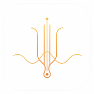
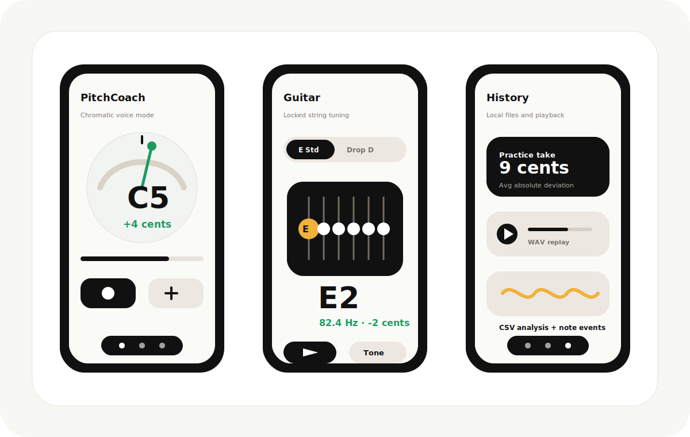

# PitchCoach

<p align="center">
  
</p>

<p align="center">
  <strong>A privacy-first Android pitch coach for voice practice, guitar tuning, and local recording review.</strong>
</p>

<p align="center">
  
</p>

PitchCoach is an Android MVP for musicians who want fast, readable pitch feedback without sending audio to the cloud. It combines a minimalist music-tool interface with a local pitch engine, saved practice files, and a dedicated fixed-string guitar tuner.

## Highlights

- **Chromatic pitch coach**: live note, octave, cents offset, stability, volume, and a fixed +/-10 cents in-tune zone.
- **Precision-first pitch engine**: rolling analysis windows with hybrid YIN + MPM detection, octave-aware filtering, and conservative disagreement handling.
- **Guitar tuner mode**: lock to a specific string instead of auto-jumping, choose common tunings, and play a reference tone for the selected string.
- **Guitar reference tone**: uses a real acoustic guitar recording as the sound source instead of a plain sine wave.
- **Practice files**: save each take as local `.pitchcoach.csv` analysis data plus a `.wav` recording.
- **Replay and review**: listen back to saved recordings and compare them with summary metrics.
- **Local by design**: no account, no AI upload, no subscription, and no server dependency in the current MVP.
- **Apple-inspired interface**: calm monochrome surfaces, warm musical accents, icon-first navigation, and focused tool screens.

## Modes

### Voice / Chromatic

The chromatic mode maps detected frequency to 12-tone equal temperament with A4 = 440 Hz. It is designed for singers and melody instruments that need stable feedback on pitch center, sharp/flat direction, and sustained-note control.

### Guitar

The guitar mode is intentionally different from voice practice. You select a tuning and lock onto one string target until it is tuned. PitchCoach folds detected harmonics back to the selected string octave before calculating cents, which helps with guitar strings whose fundamentals can be weaker than their overtones.

Included tunings:

- Standard: E2 A2 D3 G3 B3 E4
- Half Step Down: Eb2 Ab2 Db3 Gb3 Bb3 Eb4
- Drop D: D2 A2 D3 G3 B3 E4
- D Standard: D2 G2 C3 F3 A3 D4
- DADGAD: D2 A2 D3 G3 A3 D4
- Open G: D2 G2 D3 G3 B3 D4
- Open D: D2 A2 D3 F#3 A3 D4

## Technical Shape

- Kotlin + Android + Jetpack Compose
- `AudioRecord` microphone capture
- Hybrid YIN / McLeod-style pitch detection
- Rolling sample window for more stable frequency estimates
- Note and cents mapping utilities
- File-backed practice sessions with WAV replay
- Room data layer retained for local persistence experiments and tests

Current package layout:

```text
com.pitchcoach
  core/audio
  core/music
  core/pitch
  core/session
  data/database
  data/repository
  features/pitchmeter
```

## Build

Open the project in Android Studio, let Gradle sync, then run the `app` configuration on an Android device.

CLI build:

```bash
./gradlew :app:testDebugUnitTest :app:assembleDebug
```

See [docs/TESTING_ENVIRONMENT.md](docs/TESTING_ENVIRONMENT.md) for the local JDK, Android SDK, and Gradle setup used during development.

## Project Status

PitchCoach is an MVP. The core pitch, guitar, recording, replay, and local history flows are implemented. The project does not currently include cloud sync, AI coaching, song import, billing, or a production release pipeline.

## License

MIT License. See [LICENSE](LICENSE).

Third-party audio notices are listed in [THIRD_PARTY_NOTICES.md](THIRD_PARTY_NOTICES.md).
